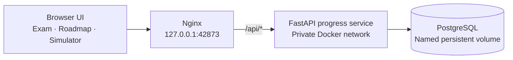

# ArchReady — AWS SAA Exam & Architecture Lab

ArchReady is a self-hosted study environment for the AWS Certified Solutions Architect – Associate (SAA-C03) exam. It combines timed mock exams, focused domain practice, persistent progress tracking, a structured learning roadmap, and a guided AWS architecture simulator in one application.

> Recommended GitHub repository name: **`archready-aws-saa-lab`**

ArchReady is an independent educational project. It is not affiliated with, endorsed by, or sponsored by Amazon Web Services.

## Highlights

- **Realistic exam simulation** — 65-question, 130-minute full mock exams with navigation, flags, unanswered-question review, and delayed feedback.
- **Flexible practice** — quick sessions, custom question counts, weak-area drills, learning-topic sessions, official SAA-C03 domains, and service-specific labs.
- **Service Lab** — browse AWS services such as Amazon S3 and AWS WAF, learn what each service does and when to use it, then launch a question set matched to that service.
- **Light and dark themes** — follows the operating-system preference initially and remembers an explicit theme choice in the browser.
- **Large classified bank** — 1,659 source records, including 1,624 usable questions organized into 13 learning topics and four exam domains.
- **Answer learning** — correct answers and explanations appear after practice submissions and in completed-session review.
- **Persistent progress** — PostgreSQL stores attempts, answer history, active sessions, statistics, roadmap milestones, readiness inputs, and simulator state.
- **Service and module progress** — PostgreSQL stores explicit coverage and accuracy summaries for every AWS service, learning topic, and official exam domain.
- **Readiness evidence** — a weighted learning-progress score plus a strict mock-exam readiness gate.
- **Actionable insights** — the dashboard identifies the lowest-accuracy studied topic and exam domain, then links directly to focused practice.
- **Session history** — browse every stored result, filter by study mode, and compare aggregate score, answer, and study-time totals.
- **Architecture lab** — design a small AWS workload from requirements through networking, security, compute, serverless integration, deployment simulation, and cost analysis.
- **12-week roadmap** — a dependency-based tree from AWS fundamentals to an exam and portfolio sprint.
- **One-command startup** — Docker Compose starts the frontend, backend API, and database.

## Application architecture



Only the Nginx frontend is exposed to the host. The API and PostgreSQL services remain inside the Docker network. Browser storage acts as a responsive local cache; PostgreSQL is the durable store when the Docker stack is used.

## Quick start

### Requirements

- Docker Desktop or Docker Engine with Docker Compose
- an available local TCP port (the default is `42873`)

### Start the complete application

```bash
git clone https://github.com/YOUR_USERNAME/archready-aws-saa-lab.git
cd archready-aws-saa-lab
docker compose up --build -d
```

Open [http://127.0.0.1:42873](http://127.0.0.1:42873). The header should display **Database synced** after the API and PostgreSQL health checks pass.

Check container status or follow logs:

```bash
docker compose ps
docker compose logs -f web api db
```

Stop the application:

```bash
docker compose down
```

Normal shutdown does not delete progress. Do not use `docker compose down -v` unless you intentionally want to delete the database volume.

### Use a different port

```bash
ARCHREADY_PORT=43873 docker compose up --build -d
```

The database and API do not publish host ports, which helps prevent conflicts with other local projects.

## Configuration

Copy the example environment file before the first startup if you want custom database credentials:

```bash
cp .env.example .env
```

Set a long local password in `.env`, then start Compose. PostgreSQL initializes credentials only when it creates a new data volume; changing `.env` later does not modify an existing database cluster.

## Data persistence

The named Docker volume `archready-postgres-data-v1` stores:

- per-question attempts, accuracy, and weak-area statistics;
- completed exam and practice history;
- selected answers and question-review data;
- the active timed session and deadline;
- total study time and study dates;
- roadmap completion;
- simulator configuration and deployment history;
- readiness inputs and recent mock results.

## Resume an in-progress session

Starting a practice set or full mock immediately saves an in-progress snapshot. The dashboard shows a **Saved session** card after a browser refresh, tab close, or return visit; select **Resume** to continue at the same question with your selected answers, flags, and feedback state intact. For a timed mock, the countdown uses its original deadline, so time continues to elapse while the page is closed.

Choose **Discard** on the saved-session card to remove an unfinished session without adding it to study history or changing accuracy. A completed or empty submitted session is automatically removed from saved progress.

Back up the default database:

```bash
docker compose exec -T db pg_dump -U archready archready > archready-backup.sql
```

Restore a backup into a fresh database:

```bash
docker compose exec -T db psql -U archready archready < archready-backup.sql
```

SQL backups and `.env` are ignored by Git.

## Exam and practice modes

| Mode | Questions | Timer | Feedback |
| --- | ---: | ---: | --- |
| Quick practice | 10 | Untimed | After each answer |
| Full mock exam | 65 | 130 minutes | After submission |
| Weak-area drill | Up to 15 | Untimed | After each answer |
| Topic practice | Up to 15 | Untimed | After each answer |
| Official-domain practice | Up to 20 | Untimed | After each answer |
| Service Lab | Up to 15 | Untimed | After each answer |
| Custom session | 5–65 | Optional | Depends on session type |

During a session, use number keys `1`–`5` to select answers, the left and right arrow keys to move between available questions, and `F` to toggle the review flag. The same actions remain available as on-screen controls.

The official SAA-C03 domain view follows the current blueprint:

- Design Secure Architectures — 30%
- Design Resilient Architectures — 26%
- Design High-Performing Architectures — 24%
- Design Cost-Optimized Architectures — 20%

The separate Service Lab organizes the bank by explicit service mentions in each question and its supplied correct answer. A comparison question may appear under more than one service, while the underlying question bank remains deduplicated. Service cards include a plain-language description, common use cases, completed-question count, coverage, and accuracy.

## Readiness model

The learning-progress percentage is calculated from:

| Signal | Weight |
| --- | ---: |
| Overall answer accuracy | 55% |
| Average of the latest five full mocks | 25% |
| Coverage of up to 250 unique questions | 15% |
| Recent score consistency | 5% |

This percentage measures study growth; it does not grant exam-ready status by itself.

## Progress insights

After at least three answered questions in a learning topic or official exam domain, the dashboard recommends the lowest-accuracy eligible area. Topic and domain recommendations are calculated independently, so you can choose between a narrow knowledge area and the exam blueprint category that needs attention. These recommendations are study prompts, not exam-readiness decisions.

ArchReady deems a learner **exam-ready only when at least 3 of the latest 4 completed full mock exams score 85% or higher**. Three qualifying mocks are sufficient. Practice, custom, weak-area, and topic sessions do not count toward this gate.

Timed-out sessions and sessions submitted without any answers are treated as incomplete. They do not enter history or affect accuracy, per-question statistics, study time, mock averages, or readiness.

## Session history

Select **View all history** beside recent activity to browse up to 100 stored completed sessions. Filters separate full mocks, general practice, and focused domain, topic, service, or weak-area work. The summary updates with the filtered session count, average score, submitted answers, and recorded study time.

AWS uses scaled exam scoring, so ArchReady's raw percentages are study guidance rather than a prediction or guarantee of certification results.

## Architecture simulator

The guided simulator takes a small project from initial requirements to a simulated deployment:

1. Select project requirements, environment, and AWS Region.
2. Design a VPC with public/private subnets, endpoints, and NAT decisions.
3. Choose between a cost-aware Security Group/NACL/WAF baseline and AWS Network Firewall based on explicit traffic-inspection requirements, then configure Session Manager and flow logging.
4. Select EC2, EBS, and Auto Scaling settings.
5. Configure API Gateway, Lambda, DynamoDB, S3, and workload assumptions.
6. Review reliability, security, cost, performance, and operational scores.
7. Run deployment validation and inspect simulated logs.
8. Review an illustrative monthly cost estimate and recommendations.

The lab never connects to an AWS account or creates real resources. Its prices are illustrative samples and exclude the AWS Free Tier, taxes, support plans, and unlisted transfer charges.

## Question-bank pipeline

The generated bank lives in `data/questions.js`. Importers preserve supplied correct answers, skip duplicates, classify questions, repair reviewed OCR issues, and add explanations only where a substantive explanation is missing.

### Rebuild the original text bank

```bash
node scripts/build-question-bank.mjs /path/to/questions.txt data/questions.js
```

### Merge the topic-organized repository

```bash
node scripts/merge-topic-bank.mjs /path/to/extracted-topic-repository data/questions.js
```

### Merge the checkbox-style Markdown archive

```bash
node scripts/merge-markdown-bank.mjs /path/to/question-bank.zip data/questions.js
```

The current Markdown import parses 710 records, adds 679 unique questions, and skips 31 exact or high-similarity duplicates.

### Add missing explanations and classify records

```bash
node scripts/enrich-explanations.mjs data/questions.js
node scripts/classify-domains.mjs data/questions.js data/questions.js
```

The explanation generator uses the supplied correct answer, relevant AWS service behavior, and scenario requirements. Generated explanations are marked with `explanationSource: "generated-from-supplied-answer"`; existing substantive explanations are not overwritten.

The classification step fails on malformed field types, invalid selection counts, known unresolved OCR fragments, or exact normalized duplicates.

## Frontend-only development

The frontend has no compilation step. For UI-only work, run:

```bash
python3 -m http.server 4173
```

Then open [http://localhost:4173](http://localhost:4173). PostgreSQL synchronization is not available in this mode, so progress remains in browser storage.

## Optional AWS account synchronization

The repository also includes an optional multi-user AWS backend:

- Amazon Cognito managed login using authorization code flow with PKCE;
- API Gateway HTTP API with JWT authorization;
- AWS Lambda progress operations;
- DynamoDB on-demand storage with point-in-time recovery.

Deploy it with AWS SAM:

```bash
sam build --template-file backend/template.yaml
sam deploy --guided
```

After deployment, configure the frontend with the stack outputs:

```bash
node scripts/configure-cloud.mjs \
  'https://API_ID.execute-api.REGION.amazonaws.com' \
  'https://YOUR_PREFIX.auth.REGION.amazoncognito.com' \
  'COGNITO_CLIENT_ID' \
  'https://study.example.com/'
```

Keep deployment-specific `cloud-config.js` values out of public commits if you want the repository to remain environment-neutral.

## Project structure

```text
.
├── index.html                 # Application shell
├── app.js                     # Exam, progress, roadmap, and simulator UI
├── learning.js                # Roadmap, lab steps, and sample cost data
├── services.js                # AWS service catalog and Service Lab descriptions
├── styles.css                 # Responsive visual system
├── cloud-sync.js              # PostgreSQL/AWS progress synchronization client
├── data/questions.js          # Generated classified question bank
├── backend-local/             # FastAPI + PostgreSQL service used by Docker
├── backend/                   # Optional AWS SAM, Lambda, Cognito, and DynamoDB stack
├── docker/                    # Nginx and Docker-specific frontend configuration
├── scripts/                   # Import, deduplication, explanation, and classification tools
├── Dockerfile
└── docker-compose.yml
```

## Verification

Useful local checks:

```bash
node --check app.js
node --check services.js
node --check cloud-sync.js
node --check data/questions.js
node --check scripts/classify-domains.mjs
docker compose config --quiet
```

## Content rights and responsible publishing

Question content can originate from separately supplied study resources. Before making a repository public, confirm that you have permission to redistribute every included question bank and associated explanation. If the source license or permission is unclear, keep `data/questions.js` in a private repository or replace it with content you own or are licensed to distribute.

Generated explanations are study aids and should be independently verified against current AWS documentation. AWS services, limits, pricing, and certification objectives can change.

## Contributing

Contributions are welcome for application behavior, accessibility, tests, import validation, original questions, and corrections supported by current AWS documentation. Please avoid submitting exam dumps or material that you do not have permission to redistribute.

## License

No open-source license has been selected yet. Until a license is added, normal copyright restrictions apply to the project source. Choose a code license only after separately reviewing the redistribution rights for bundled question content.
